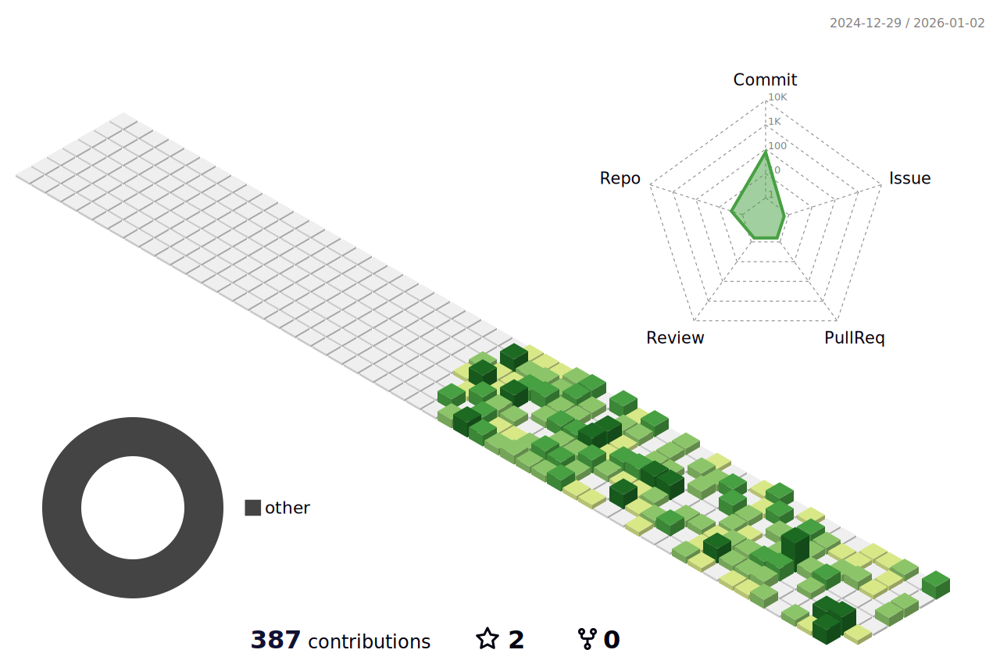

<h1 align="center">
     
    👋 Hi, I'm Aditya Singh
</h1>
<h3 align="center">Developer • Designer • Explorer</h3>

  🚀 Passionate about Frontend Development, UI/UX, AI & Automation  

---

### 🌎 About Me
- 🎓 Engineering student from India
- 💻 Building cool things using **JavaScript, Python & IoT**
- 🎨 Aesthetic-first designer using Figma, Photoshop & creativity ✨
- 🌱 Currently learning: **Advanced JS + AI agent integration**
- 🤝 Looking to collaborate on **open-source & innovative tech**
- 📩 Reach me: **adityasingh28012007@gmail.com**

---

---

## 🛠 Tech Stack

  

---

## 📊 GitHub Stats & Activity

    

    
  

  
    
  

---

## 📈 Contribution Graph

---

## 🏆 GitHub Trophies

  

---

## ✨ Random Dev Quote

  

## 📊 3D Contribution Graph

