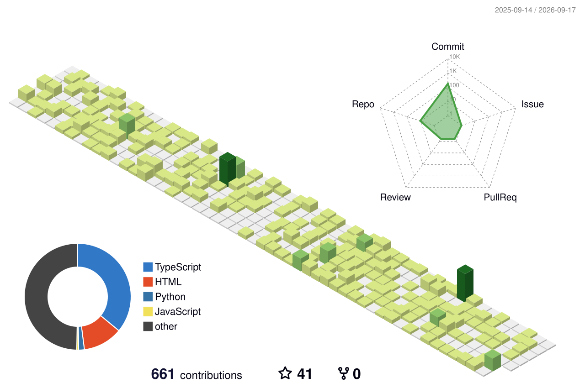

  <picture>
    <source media="(prefers-color-scheme: dark)" srcset="./assets/dark_mode.svg">
    <source media="(prefers-color-scheme: light)" srcset="./assets/light_mode.svg">
    
  </picture>

---

<h2 align="center">📊 3D Contribution Graph</h2>

  <picture>
    <source media="(prefers-color-scheme: dark)" srcset="./profile-3d-contrib/profile-night-green.svg">
    <source media="(prefers-color-scheme: light)" srcset="./profile-3d-contrib/profile-green-animate.svg">
    
  </picture>

